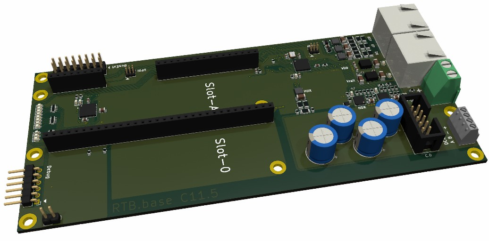
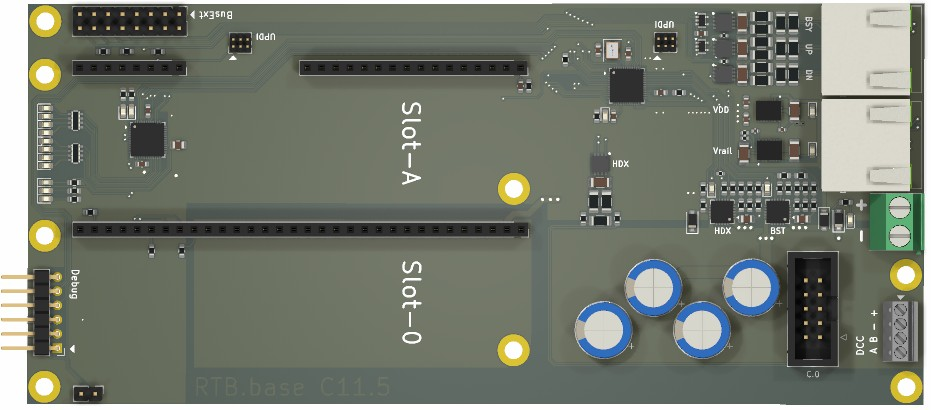
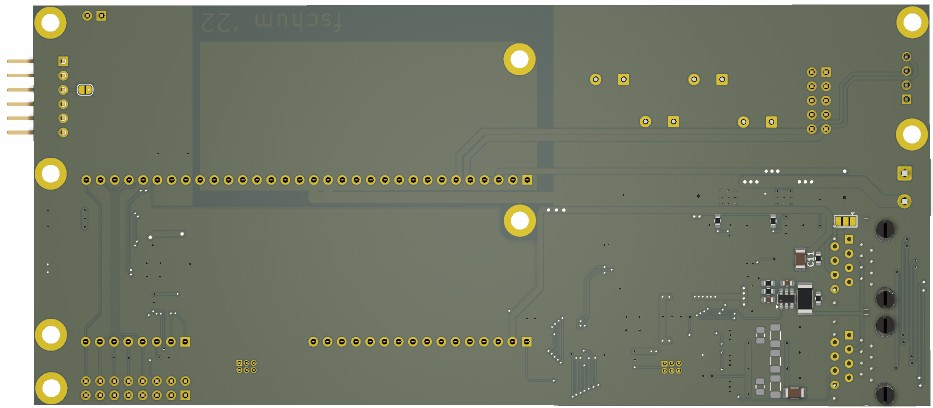

# RTB_C11

**RTB C11 Powerboard: Smart Power Protection.** This homebrew powerboard actively monitors input voltage to safeguard connected RTB modules. It automatically **interrupts power** to the RTB subsystem if the voltage drifts outside the **safe range of 12V to 18V**, preventing damage from erroneous power conditions.

See also

- [RTB_C10 - Master](https://github.com/git4dcc/RTB_C10)
- [RTB_C11 - Power](https://github.com/git4dcc/RTB_C11)
- [RTB_C12 - Micro Booster](https://github.com/git4dcc/RTB_C12)
- [RTB_P15 - Base](https://github.com/git4dcc/RTB_P15)

User Guides

- User Guide - DE
- [User Guide - EN](https://rtb4dcc.de/rtb_user_guide_en/)

## Powerboard features
- **FDX bus**
  - 2Mbps full duplex, RS-485 differential
- **HDX bus**
  - 2Mb, half duplex, RS-485 differential
  - up to 2A DCC continuous current
  - up to 2A HDX continuous current
- **Power input**
  - Under-, Over-, Reverse voltage protection
  - 14-18V DC, >4A
  - Soft start
  - Short circuit detection with software configurable latch-off, hiccup or current limiter mode
- **Expansion slots**
  - Bus Master Slot (Slot-A)
  - Booster Slot (Slot-0)
- firmware update over the bus

# Hardware
The PCB layout uses SMD footprints with 0.4mm pitch and a mix of 0603 and 0402 parts. Reflow soldering is mandatory.

## PCB
- 2-layer PCB, FR4, 1.6mm
- CPU: AVR64DB48, Atmega4809
- PMIC: MAX17613AATP+

# Firmware
Filename structure: { **pcb** }{ **code** }{ **version** }.hex

Example: **C11F0001**.hex

|   | Description |
| --- | --- |
| **pcb** | Name of matching hardware (**C11**) |
| **code** | Type of code contained (**R**=rom, **B**=bootloader, **F**=flash, **U**=bld update, **P**=UPDI factory code) |
| **version** | Release version (**####**) |

[Firmware files](firmware)
